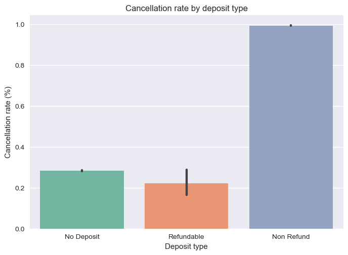

# 🏨 Analyse des annulations de réservations d’hôtels

### 📊 Projet d’analyse de données — par **Fatima Zahra**

---

## 🎯 Objectif du projet

Ce projet vise à **comprendre les raisons des annulations fréquentes de réservations** par les clients,
en étudiant des données réelles contenant des informations sur :

* le type d’hôtel (City / Resort)
* la durée de réservation anticipée
* le type de dépôt
* le type de client
* le pays

Le tout en utilisant **Python**, **Pandas** et **Seaborn** pour analyser les données et en tirer des conclusions pratiques.

---

## 🧠 Étapes de l’analyse (Workflow)

1. **Importer les données** depuis un fichier CSV
2. **Exploration des données (EDA)** pour identifier les valeurs manquantes et les statistiques de base
3. **Analyse du taux d’annulation selon le type d’hôtel**
4. **Relation entre la durée de réservation (`lead_time`) et l’annulation**
5. **Impact du type de dépôt (`deposit_type`) et du type de client (`customer_type`) sur l’annulation**
6. **Analyse des annulations par pays**
7. **Conclusions et recommandations pratiques**

---

## 📈 Principaux résultats

* Le **taux global d’annulation** est d’environ **40 %**
* Les **City Hotels** connaissent **plus d’annulations** que les Resorts
* Plus la **durée de réservation anticipée** est longue, plus la probabilité d’annulation augmente
* La politique **No Deposit** entraîne des taux d’annulation plus élevés
* Certains pays présentent des taux d’annulation plus élevés que d’autres

---

## 🖼️ Exemples d’analyses

### 1️⃣ Taux d’annulation selon le type d’hôtel :

### 2️⃣ Relation entre la durée de réservation et l’annulation :

### 3️⃣ Impact du type de dépôt sur l’annulation :

---

## 🛠️ Outils et technologies utilisées

| Technologie          | Objectif                             |
| -------------------- | ------------------------------------ |
| Python               | Langage principal pour l’analyse     |
| Pandas               | Traitement et nettoyage des données  |
| Seaborn / Matplotlib | Visualisation et analyse statistique |
| Jupyter Notebook     | Environnement interactif             |
| GitHub               | Partage et présentation du projet    |

---

## 🌟 Conseils professionnels

* Tous les graphiques sont **enregistrés dans le dossier `visuals/`** pour un affichage facile sur GitHub
* Vous pouvez modifier **les couleurs et les styles** directement avec Seaborn/Matplotlib
* Utilisez Markdown pour écrire des sous-titres et expliquer chaque graphique afin de clarifier les résultats

---

## 📬 Contact

📧 Email : [fatiz.errami@gmail.com](mailto:fatiz.errami@gmail.com)
💼 [LinkedIn](https://www.linkedin.com/)
🐙 [GitHub](https://github.com/)

---

> Ce projet fait partie de mon parcours d’apprentissage en **analyse de données**,
> et j’aspire à travailler comme analyste de données à distance pour des entreprises françaises 🇫🇷
